# CUDA PathTracer with Reinforcement Learning
Monte Carlo based path tracer with both CPU(with openMP) and GPU support(with CUDA). This is done as the course project for the GPU course. 

CUDA based renderer optionally uses Reinforcement Learning (**based on ideas from NVIDIA paper**: [Learning Light Transport the reinforced way](https://arxiv.org/abs/1701.07403)).

RL assumes that every ray has 8 actions available to choose from in each bounce(based on the 8 octants). So a QTable is built upon that and the most optimum path is chosen. With time, the rays learn the best path to take to reach the light source. Since this is online Reinforcement Learning, there is no training period and the values converge pretty fast.

The main code for this is in `renderengine_gpu.cu`
The parameters for path tracing can be changed in `pathtracer_params.h`

**For more information on implementation and the output, read the short poster or the full report for the project: [Poster.pdf](CUDAPathTracerRLPoster.pdf) and [Report.pdf](CUDAPathTracerRLReport.pdf)**

The project can be built using Clion(on Windows) or cmake.
Check out template for Clion for use of CUDA: https://github.com/PalashBansal96/CUDAClionStarterProject/

## Renders 

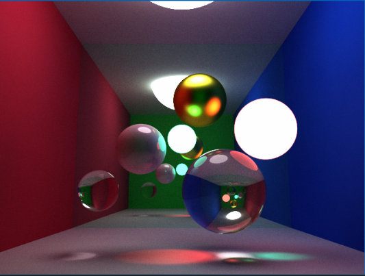 
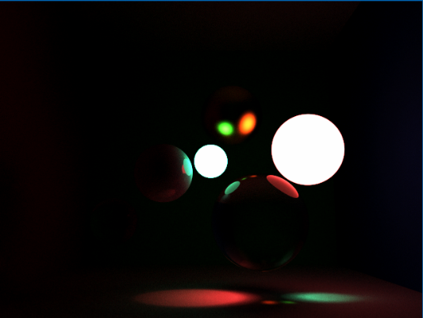 
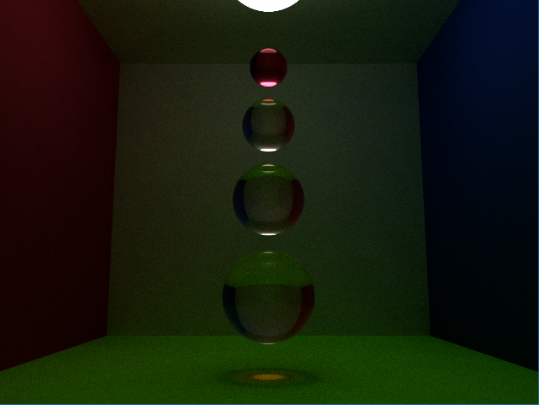 
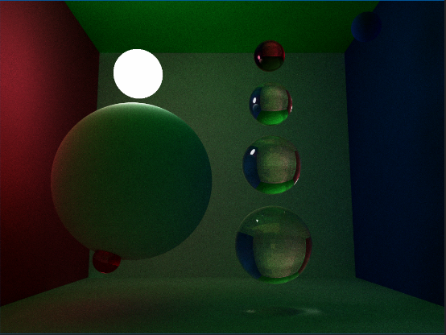 

## CPU vs GPU comparision(no RL)

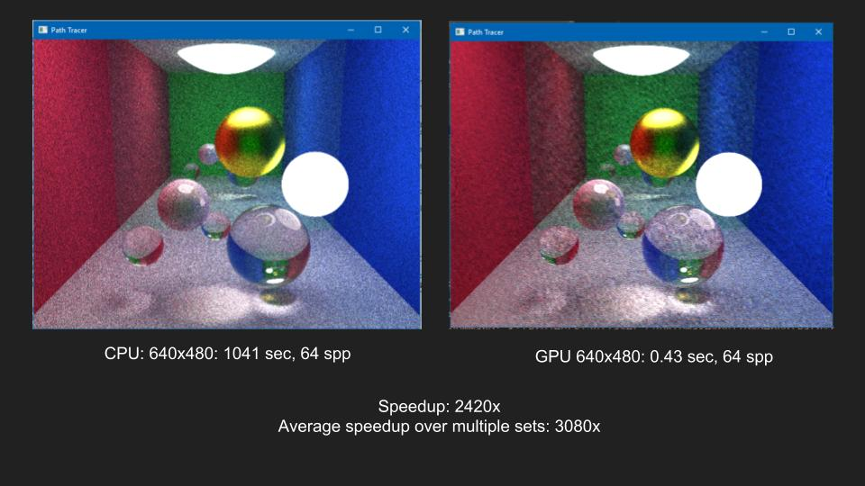

## Path tracing with Reinforcement learning on GPU

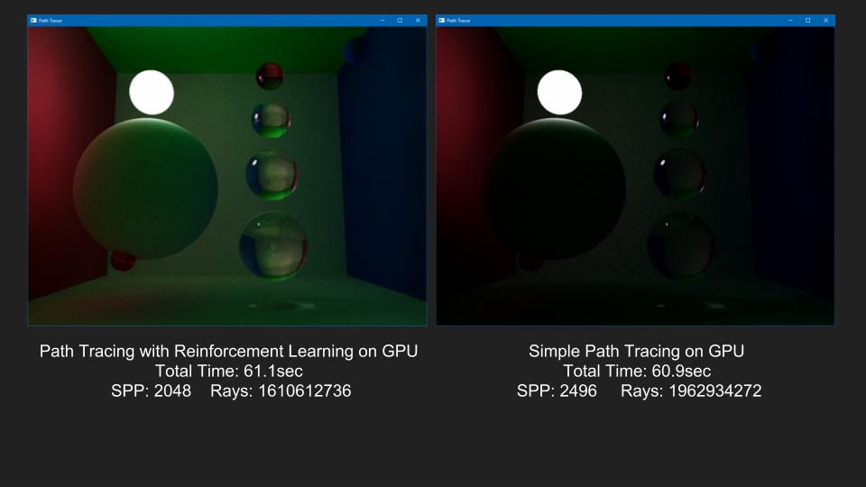
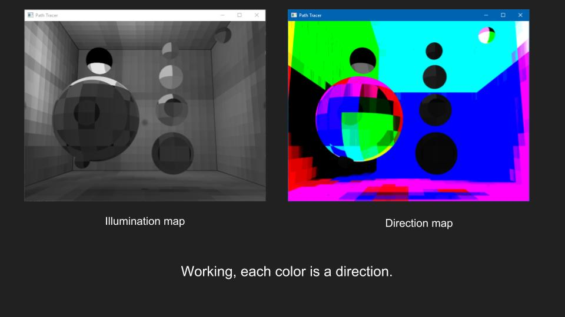

We can see here that in the same time, the rays were able to find a better path for indirect lighting, hence better illumination.

### More comparisions
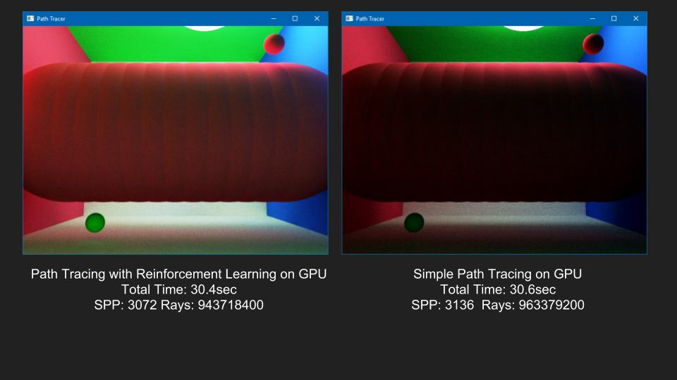
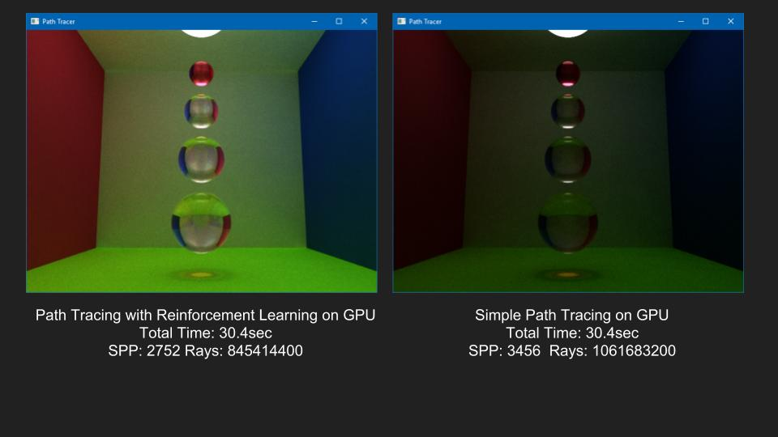
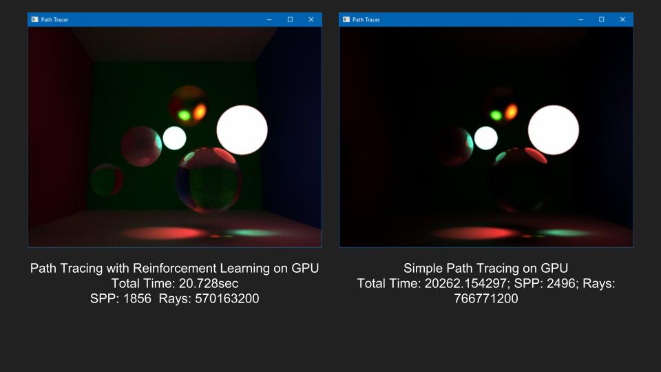

## Issues with RL based lighting
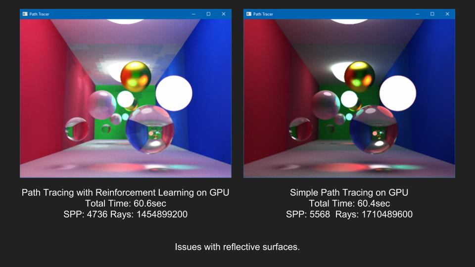
